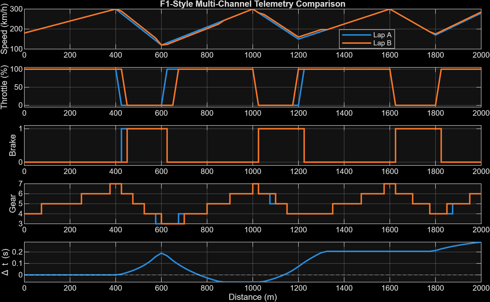

# MATLAB F1-Style Lap-Time and Telemetry Analysis

## Overview

This project is a MATLAB-based telemetry analysis tool developed to investigate lap-time differences between two simulated racing laps.

An F1-style synthetic telemetry dataset is generated containing distance, speed, throttle, brake and gear channels for two laps. The dataset is exported to CSV and processed by a separate MATLAB analysis script.

The tool reconstructs lap time from distance and speed measurements, calculates the cumulative time difference between the two laps, compares multiple telemetry channels and extracts performance metrics from a defined corner section.

The project was developed as a learning experience in applying MATLAB to motorsport engineering data analysis. All telemetry used in this project is synthetic and does not represent real Formula 1 vehicle or driver data.

## Key Features

- Generates synthetic multi-channel telemetry for two simulated laps.
- Imports and processes telemetry from a CSV file.
- Reconstructs lap time using distance and speed data.
- Calculates cumulative time delta between two laps.
- Compares speed, throttle, brake and gear traces.
- Identifies braking point, minimum speed and throttle reapplication.
- Calculates time gained or lost through a defined corner section.
- Produces a multi-channel telemetry dashboard.

## Telemetry Dashboard



The dashboard compares Lap A and Lap B across speed, throttle, brake, gear and cumulative time delta over the simulated 2000 m lap.

## Methodology

Lap time is reconstructed by dividing each distance interval by the average vehicle speed across that interval:

\[
\Delta t = \frac{\Delta d}{\bar{v}}
\]

Speed is converted from km/h to m/s before calculating interval time. The individual interval times are accumulated to reconstruct total lap time and calculate the cumulative time difference between Lap A and Lap B.

A defined Corner 1 region from 400 m to 850 m is also isolated to compare braking point, minimum speed, throttle reapplication and section time.

## Results

The reconstructed lap times were:

| Metric | Result |
|---|---:|
| Lap A | 33.505 s |
| Lap B | 33.218 s |
| Lap-time difference (A - B) | +0.286 s |

Lap B completes the full simulated lap approximately 0.286 s faster than Lap A.

For the defined Corner 1 section:

| Metric | Lap A | Lap B |
|---|---:|---:|
| Braking point | 425 m | 450 m |
| Minimum speed | 120.0 km/h | 120.0 km/h |
| Throttle reapplication | 625 m | 675 m |
| Section time | 8.949 s | 9.006 s |

Lap B brakes 25 m later and initially gains time on corner entry. Lap A reapplies throttle 50 m earlier and completes the 400–850 m section approximately 0.056 s faster, demonstrating an entry-versus-exit performance trade-off in the simulated telemetry.

## Project Structure

```text
F1-Lap-Time-Telemetry-Analysis/
│
├── generate_telemetry_data.m
├── lap_time_analysis.m
├── README.md
│
├── data/
│   └── simulated_multichannel_telemetry.csv
│
└── figures/
    └── telemetry_comparison.png
```

## How to Run

### Requirements

- MATLAB

### Instructions

1. Download or clone the repository.
2. Open the project directory in MATLAB.
3. Run `generate_telemetry_data.m` to generate the synthetic telemetry CSV.
4. Run `lap_time_analysis.m` to perform the lap-time and corner analysis.
5. View the numerical results in the MATLAB Command Window and the generated telemetry dashboard.

## Limitations

- The telemetry is synthetic and does not represent data from a real Formula 1 car.
- Throttle and brake behaviour is simplified.
- Brake input is represented as a binary signal rather than brake pressure.
- Gear selection is estimated from speed thresholds rather than modelled independently.
- Corner analysis is currently performed on one predefined section of the lap.

## Future Development

Potential future improvements include:

- Automated analysis of multiple corners.
- Support for real motorsport telemetry datasets.
- Additional channels such as RPM and steering input.
- More realistic continuous throttle and brake signals.
- Automatic identification of braking and acceleration zones.
- Further modularisation of the MATLAB analysis using functions.
